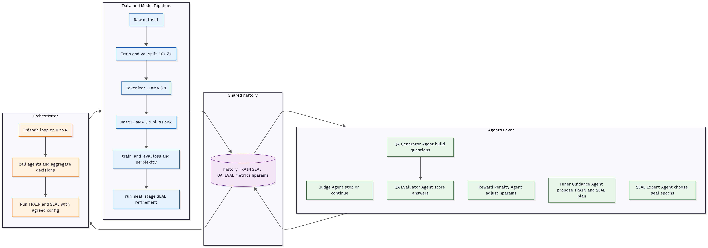

# Agentic LLaMA 3.1 LoRA + SEAL Tuning
## Architecture Overview
## block diagram

## Low level design arch



In this project I experiment with an agentic training loop around Meta LLaMA 3.1 using LoRA fine-tuning and a SEAL-style self-refinement stage.  
The idea is to let a set of LLM agents act as a virtual ML team that:

- proposes hyperparameters,
- decides when to refine the model with SEAL,
- evaluates improvements using loss, perplexity and QA quality,
- and decides when to stop training.

All of this runs on top of a standard Hugging Face training pipeline (Transformers + PEFT).

---

## High-level Overview

The system has four main parts:

1. **Data & Model Pipeline**
2. **Shared History Store**
3. **Agent Layer (agentic AI in the loop)**
4. **Orchestrator (episode loop)**


---

## 1. Data & Model Pipeline

This is the standard training stack that everything else revolves around.

### Dataset

- I use an Alpaca-style instruction dataset:
  - `instruction`
  - `input`  (optional)
  - `output`
- I typically take:
  - `10k` examples for training
  - `2k` examples for validation  
  (the exact numbers are configurable).

### Tokenization

- Tokenizer: **LLaMA 3.1 tokenizer**
- Steps:
  1. Format each sample into a prompt-completion style string.
  2. Tokenize with truncation and attention masks.
  3. Build:
     - `tokenized_train`
     - `tokenized_val`

### Base Model + LoRA

- Base model: `Meta-Llama-3.1` (Instruct variant).
- The function `get_base_model()`:
  - Loads the model from Hugging Face.
  - Uses `torch.bfloat16` on GPU (A100-friendly).
  - `attn_implementation="flash_attention_2"` is enabled if the environment supports it for speed.
  - Disables `use_cache` during training.

- The function `make_lora_model(base_model, ...)`:
  - Wraps the base model with PEFT **LoRA**.
  - Target modules:
    - `q_proj`, `k_proj`, `v_proj`, `o_proj`
    - `gate_proj`, `up_proj`, `down_proj`
  - Tunable LoRA hyperparameters:
    - `r`
    - `alpha`
    - `dropout`

### Training: `train_and_eval(hparams)`

This is the core training function used by both the main training stage and the SEAL stage.

Given a hyperparameter dict:

- `lr`
- `batch_size`
- `epochs`
- `warmup_ratio`
- `lora_r`
- `lora_alpha`
- `lora_dropout`
- `trial_id`

the function:

1. Builds a fresh base model (`get_base_model`).
2. Wraps it with LoRA (`make_lora_model`).
3. Creates `TrainingArguments` and a `Trainer`:
   - `per_device_train_batch_size = batch_size`
   - `num_train_epochs = epochs`
   - `learning_rate = lr`
   - `warmup_ratio`
   - `bf16` if CUDA is available
   - `remove_unused_columns = False`
4. Runs:
   - `trainer.train()`
   - `trainer.evaluate()` on `tokenized_val`
5. Computes:
   - `eval_loss`
   - `perplexity = exp(eval_loss)` (guarded for extreme values)
6. Returns the full `eval_metrics` dict (with `perplexity` added).

This function is deliberately stateless from the agent’s point of view: every call builds a new LoRA-wrapped model with its own hyperparameters.

### SEAL Stage: `run_seal_stage(history, seal_epochs)`

The SEAL stage is a self-refinement pass that also uses `train_and_eval` but with a slightly different role:

1. Looks into `history` for the **best TRAIN episode so far** (lowest `eval_loss`).
2. Prints some representative training examples from the dataset (so I can see what the refinement is “looking at”).
3. Builds a SEAL hyperparameter config based on the best TRAIN config:
   - same `lr`, `batch_size`, `lora_r`, `lora_alpha`, `lora_dropout`
   - `epochs` set to `seal_epochs` (1 or 2).
4. Calls `train_and_eval` again with a `trial_id` like `seal_from_ep_X`.
5. Returns:
   - `base_episode`
   - `seal_epochs`
   - `seal_metrics` (including loss and perplexity)

Note: SEAL here does not create synthetic data; it refines on the same dataset but is controlled by agents that monitor if this refinement is helpful or harmful.

---

## 2. Shared History

All episodes and decisions are recorded in a single `history` list, containing entries like:

```python
{
  "episode": 0,
  "kind": "train",
  "hparams": { ... },
  "metrics": {
    "eval_loss": ...,
    "perplexity": ...,
    ...
  }
}
```

and

```python
{
  "episode": 0,
  "kind": "seal",
  "seal_plan": {"seal_epochs": 1},
  "seal_info": {
    "base_episode": 0,
    "seal_epochs": 1,
    "seal_metrics": { ... }
  }
}
```

Later, QA evaluation entries can also be added (not mandatory for the basic loop).

The agents only see this `history` object. It is their “memory”.

---

## 3. Agent Layer

All agents are implemented as calls to an external LLM (e.g. `gpt-4o` / `gpt-4o-mini`) via the OpenAI API.  
Each agent receives:

- a JSON view of `history`, and sometimes:
- feedback from other agents,
- a summary of SEAL’s effect so far.

I treat each agent as a role in a virtual ML team.

### Common helper

`_call_agent(system_msg, user_msg, model_name="gpt-4o", temperature=0.4)`:

- Sends a system + user prompt.
- Expects the model to reply with **pure JSON**.
- Parses JSON and returns it as a Python dict.
- If parsing fails, it tries to extract the JSON substring.

Everything below is built on top of this helper.

---

### 3.1 Tuner / Guidance Agent

Function: `tuner_agent(history, judge_feedback, reward_feedback, seal_summary)`

Role:

- Main “expert” ML engineer.
- Reads full history, Judge feedback, Reward-Penalty feedback, and SEAL summary.
- Returns JSON:

```json
{
  "say": "Natural language explanation.",
  "hparams": {
    "lr": ...,
    "batch_size": ...,
    "epochs": ...,
    "warmup_ratio": ...,
    "lora_r": ...,
    "lora_alpha": ...,
    "lora_dropout": ...
  },
  "seal_plan": {
    "seal_epochs": 1
  }
}
```

Constraints on `hparams`:

- `lr` in `[1e-5, 5e-4]`
- `batch_size` in `[1, 2, 4, 8]`
- `epochs` in `[1, 2]`
- `warmup_ratio` in `[0.0, 0.2]`
- `lora_r` in `[8, 16, 32]`
- `lora_alpha` in `[16, 32, 64]`
- `lora_dropout` in `[0.0, 0.2]`

This agent is responsible for the initial proposal; the Reward-Penalty agent can override some fields.

---

### 3.2 Judge Agent

Function: `judge_agent(history)`

Role:

- Looks at the trend of `eval_loss` and `perplexity`.
- Decides whether to continue or stop.

JSON output:

```json
{
  "say": "Short explanation.",
  "continue": true,
  "reason": "Why continue or stop.",
  "feedback": "Actionable comments for other agents."
}
```

Rules:

- Cannot recommend stopping before at least `force_min_episodes` unless there is a very clear degradation.
- Feedback is passed to the Tuner and SEAL Expert agents.

---

### 3.3 Reward-Penalty Agent

Function: `reward_penalty_agent(history)`

Role:

- Implements a simple, handcrafted “RL-style” signal.
- Compares:
  - last TRAIN `eval_loss` vs previous TRAIN
  - SEAL `eval_loss` vs its base TRAIN episode
- Computes:
  - `train_improvement`
  - `seal_improvement`
  - `total_improvement = train_improvement + 0.5 * seal_improvement`
- Derives:
  - `reward = max(total_improvement, 0.0)`
  - `penalty = max(-total_improvement, 0.0)`

Based on the sign and magnitude of `total_improvement`, it proposes overrides on:

- `lr` (increase or decrease)
- `epochs`
- `lora_dropout`
- `lora_r`
- `lora_alpha`
- `batch_size`
- `warmup_ratio`

Example behaviour:

- If improvement is clearly positive:
  - slightly increase `lr`
  - increase `batch_size` (if possible)
  - reduce `dropout`
  - push `lora_r` and `alpha` to higher values
  - reduce `warmup_ratio`
- If clearly negative:
  - halve `lr`
  - increase `epochs`
  - increase `dropout`
  - reduce `batch_size`
  - step LoRA parameters down
  - increase `warmup_ratio`
- If close to zero (plateau):
  - mild exploration (e.g. small decrease in `lr`).

Output:

```json
{
  "say": "Explanation of what was changed.",
  "reward_signal": { ... },
  "override": {
    "lr": ...,
    "batch_size": ...,
    ...
  }
}
```

The orchestrator merges `override` into the Tuner’s proposal.

---

### 3.4 SEAL Expert Agent

Function: `seal_expert_agent(history, last_train_entry, judge_feedback, reward_feedback, seal_summary)`

Role:

- Focuses only on the SEAL stage.
- Decides how many SEAL epochs to run in the next episode (1 or 2).
- Interprets whether SEAL is helping, hurting, or neutral, based on the metrics and feedback.

JSON output:

```json
{
  "say": "Short explanation.",
  "seal_epochs": 1,
  "evaluation": "How SEAL is behaving and what to adjust."
}
```

This agent does not change TRAIN hyperparameters. It only controls the SEAL stage.

---

### 3.5 QA Generator & QA Evaluator Agents

- `QA Generator Agent`:
  - Reads history and/or dataset.
  - Generates a small set of evaluation prompts and expected answers.

- `QA Evaluator Agent`:
  - Takes the model’s answers and the expected answers.
  - Produces qualitative scores and comments.

At the moment the QA feedback is not deeply wired into the reward signals, but the structure is ready to integrate this as an additional reward term (for example, mixing loss improvement and QA quality).

---

## 4. Orchestrator (Episode Loop)

The orchestrator coordinates everything in episodes:

```python
max_episodes = 4
force_min_episodes = 3
history = []

for episode in range(max_episodes):
    ...
```

For each `episode`:

1. **Judge step**
   - If there is history, call `judge_agent(history)`.
   - Enforce `force_min_episodes`: do not stop before that unless metrics are clearly degrading.
   - If the Judge says stop and minimum episodes are satisfied, break.

2. **Reward-Penalty step**
   - Call `reward_penalty_agent(history)`.
   - Log reward signal and suggested overrides.

3. **SEAL summary**
   - Compute a text summary via `seal_effect_summary(history)` to describe how SEAL changed metrics so far.

4. **Tuner step**
   - Call `tuner_agent(...)` with:
     - history
     - Judge feedback
     - Reward-Penalty summary
     - SEAL summary
   - Get:
     - `hparams` proposal
     - `seal_plan` (next SEAL epochs)

5. **Merge hyperparameters**
   - Start from the Tuner’s `hparams`.
   - Apply Reward-Penalty overrides on top.
   - Fill any missing fields with defaults.
   - Add `trial_id = f"train_ep_{episode}"`.

6. **TRAIN call**
   - Call `train_and_eval(merged_hparams)`.
   - Append a `kind="train"` entry to `history`.

7. **SEAL Expert step**
   - Call `seal_expert_agent(...)` with:
     - updated `history`
     - `train_entry` from this episode
     - Judge and Reward feedback
     - fresh SEAL summary after training.
   - Get `seal_epochs` for the upcoming SEAL stage.

8. **SEAL call**
   - Call `run_seal_stage(history, seal_epochs)`.
   - Append a `kind="seal"` entry with `seal_info`.

9. **Optional QA evaluation**
   - (Optional) Run the QA Generator and Evaluator agents and store their scores in `history`.

10. **Print episode summary**
    - Compare TRAIN vs SEAL loss and perplexity for this episode.

At the end, the orchestrator prints the full `history` as JSON so it is easy to inspect or log.

---

## Running the Project

### Requirements

- Python 3.10+ (Colab is fine).
- GPU with at least 40 GB if using large batch sizes. I tested mainly on **A100**.
- Libraries (typical set, exact versions in the notebook or `requirements.txt`):
  - `transformers`
  - `accelerate`
  - `peft`
  - `datasets`
  - `torch`
  - `openai`
  - optionally `bitsandbytes` if quantization is used.

### Tokens and Keys

- Set your OpenAI key as an environment variable:
  - In Colab: `os.environ["OPENAI_API_KEY"] = "..."`  
    or use Colab secrets.
- Set your Hugging Face token: `HF_TOKEN`.
- Set `MODEL_NAME` to the LLaMA 3.1 checkpoint you want to use.

### Typical workflow

1. Open the notebook in Colab.
2. Install dependencies.
3. Set `HF_TOKEN`, `OPENAI_API_KEY`, and `MODEL_NAME`.
4. Run:
   - data loading and splitting cells,
   - tokenization cell,
   - model helper cell (`get_base_model`, `make_lora_model`),
   - `train_and_eval` cell,
   - agents definition cell,
   - orchestrator cell.
5. Monitor:
   - console logs for agent conversations,
   - loss and perplexity per episode,
   - SEAL effect between TRAIN and SEAL runs.

---

## Hyperparameter Ranges and Behaviour

The system is designed so that:

- The **Tuner** proposes values inside reasonable ranges.
- The **Reward-Penalty Agent** makes incremental changes based on observed improvements (or regressions).
- The **Judge** stops the process once additional episodes no longer pay off.
- The **SEAL Expert** controls how aggressively SEAL is applied.

This mimics a small training team that gradually adjusts learning rate, batch size, LoRA rank/alpha, dropout, and warmup ratio rather than relying on a one-shot search.

---

## Possible Extensions

Ideas I may explore next:

- Wire QA evaluation scores into the Reward-Penalty signal so the agents optimise not only loss, but also answer quality.
- Add a “Safety” agent that checks generated outputs for hallucinations and penalises configurations that produce unsafe or nonsensical answers.
- Log the full agent conversation and decisions into a separate JSONL file for offline analysis.
- Add support for other base models and multiple GPUs.

---

## Notes

This project is an experiment in combining:

- standard LLM fine-tuning (LoRA on LLaMA 3.1),
- SEAL-style self-refinement,
- and an agentic control loop that makes training decisions automatically.

The goal is not to beat any specific benchmark but to explore a reusable pattern for “AI in the loop” training, where LLM agents reason about metrics, history, and configuration choices and drive the optimisation process themselves.
